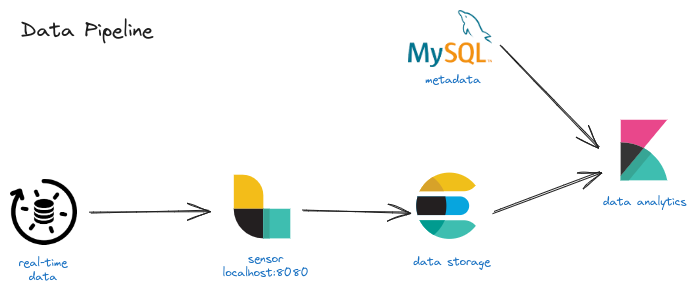
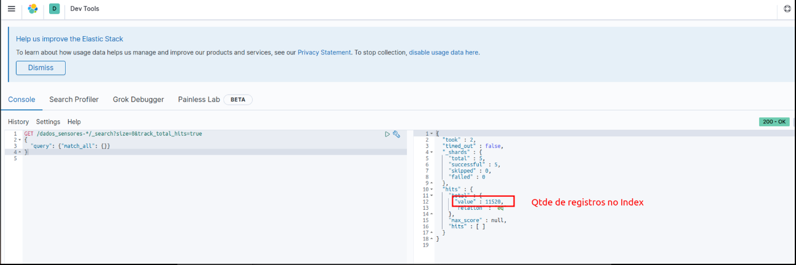
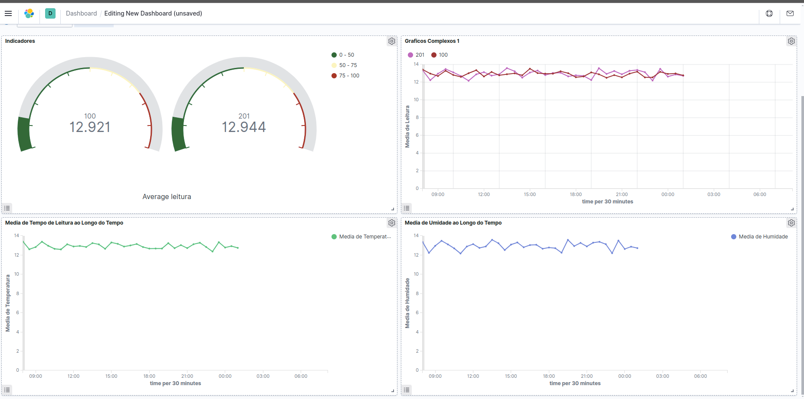

# Pipeline de Extração de Sensores IoT utilizando a Elastic Stack


> Fluxo de dados simulando a coleta de dados em tempo real por um sensor Logstash, armazenamento no Elasticsearch e análise utilizando o Kibana.

- Este é um projeto construído com base no projeto "Construindo um Pipeline de Análise de Dados de Sensores IoT" da **Formação Engenheiro de Dados** da **[Data Science Academy](https://www.datascienceacademy.com.br/start)**.

- Ele simula a extração de dados de sensores que transmitem informações sobre temperatura e umidade do ambiente em uma fábrica de alimentos, utilizando um script em `bash` para gerar os dados. Os dados compreendem: codigo do sensor, timestamp e leitura (temperatura e humidade).

- Os dados são coletados pelo Sensor do `Logstash` e armazenados no `Elasticsearch`.

- Os metadados são mantidos em um banco de dados relacional `MySQL`. Os metadados compreendem: tipo de sensor (temperatura ou humidade), localidade (sala,andar,latitude,longitude) e sensores por localidade.

- A análise dos dados é realizada usando o `Kibana`.

- A Elastic Stack foi escolhida por sua capacidade de processamento em alta velocidade e por ser uma solução open source que integra armazenamento, processamento e análise de dados em uma única plataforma.

- Para montar a arquitetura, `Docker` e `Docker Compose` são utilizados.


## Arquitetura do Projeto



## Stack de Tecnologias
- [Elasticsearch v7.9.3](https://www.elastic.co/pt/elasticsearch)
- [Logstash v7.9.3](https://www.elastic.co/pt/logstash)
- [Kibana v7.9.3](https://www.elastic.co/pt/kibana)
- [Docker v24.0.6](https://docs.docker.com/)
- [Docker Compose v2.21.0]()
- [MySQL v5.4]()


## Como executar este projeto

1. Realize o build das imagens docker: `$ docker compose build`

2. Inicie os containers: `$ docker compose up -d`

>> Verifique o trecho abaixo nos logs dos containers utilizando `docker compose logs`, isso significa que os containers foram iniciados corretamente e que o pipeline do logstash esta recebendo requisições na porta 8080 do container master.
```text
$ [2024-02-13T19:42:58,727][INFO ][logstash.inputs.http     ][main][dados_sensores_http_input] Starting http input listener {:address=>"0.0.0.0:8080", :ssl=>"false"}
```
3. Realize a carga dos dados no Elasticsearch, simulando uma carga de sensores IoT utilizando um script bash.

```bash
$ docker exec -it elastic-master bash
elastic-master$ cd /opt/logstash/files/
elastic-master$ ./carga_dados_sensores.sh
```

4. Acesse o Kibana na porta htpp://localhost:5601 e realize uma requisicao no elasticsearch para verificar a quantidade de dados de acordo com a imagem:

```json
GET /dados_sensores-*/_search?size=0&track_total_hits=true
{
  "query": {"match_all": {}}
}
```



>> Para realizar o POST individual de dados, execute, dentro do container master
```bash
$ curl -XPOST -u dados_sensores:dados_sensores --header "Content-Type: application/json" "http://localhost:8080/" -d '{"sensor_id":1,"time":1512106430000,"leitura":13.42}'
```

## Análise dos Dados no Kibana




## Histórico de Atualizações
* 0.0.1
  * Projeto Inicial
